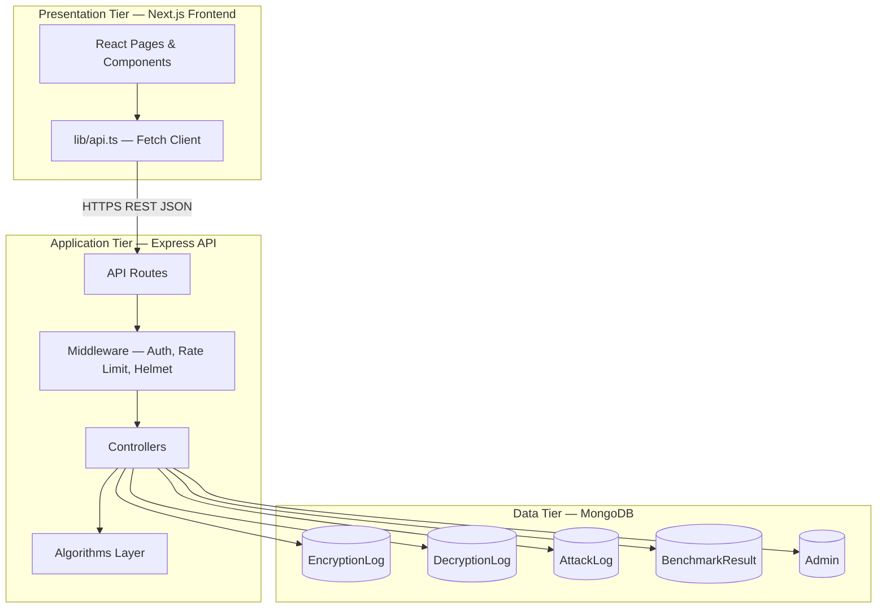
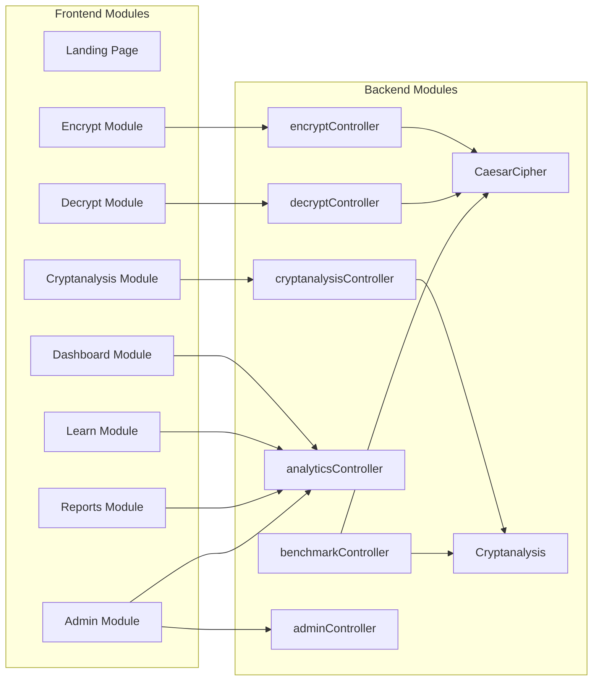
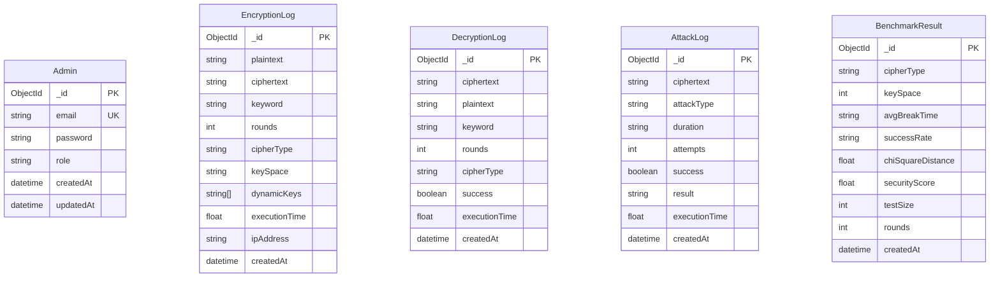
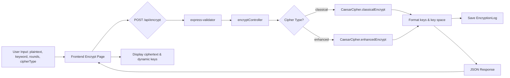
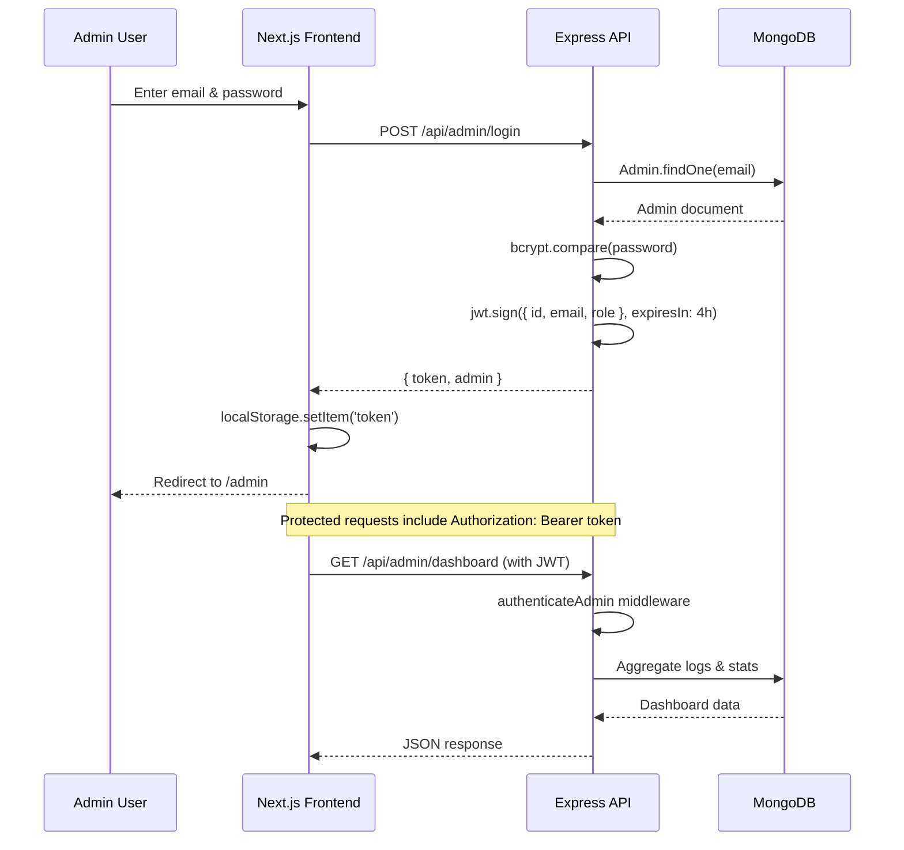
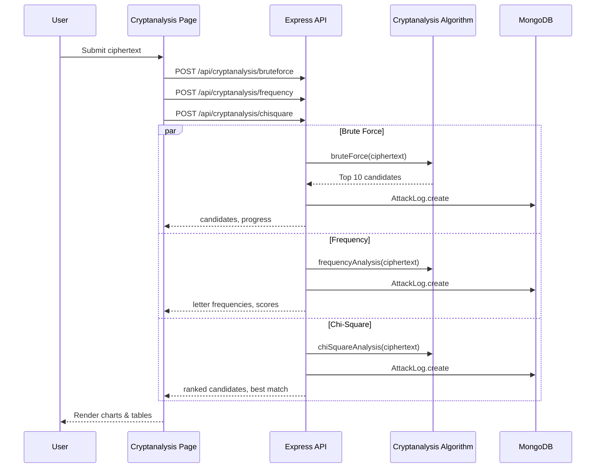
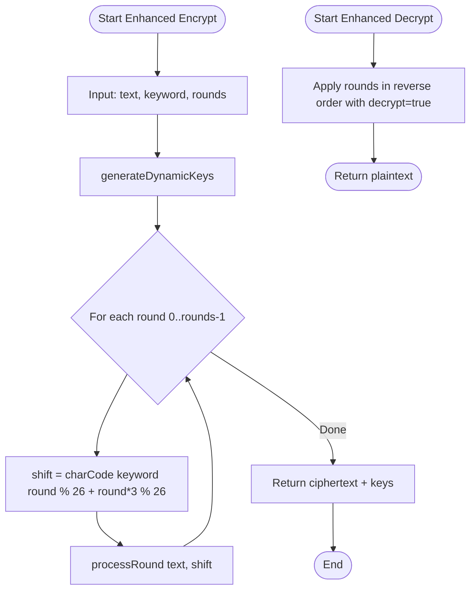
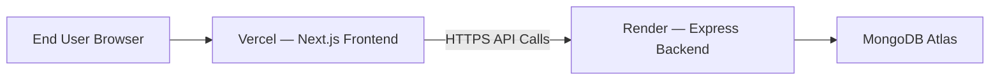

# CipherGuard — Enhanced Caesar Cipher Security Platform

**Final Year Project Documentation**

---

| **Field** | **Details** |
|-----------|-------------|
| **Project Title** | Enhanced Caesar Cipher with Dynamic Key, Multi-Round Encryption, and Automated Cryptanalysis Tool |
| **Project Name** | CipherGuard |
| **Student Name** | [Student Name] |
| **Roll Number** | [Roll Number] |
| **Guide Name** | [Guide Name] |
| **University Name** | [University Name] |
| **Department** | [Department] |
| **Academic Year** | [Academic Year] |
| **Submission Date** | [Submission Date] |

---

## Table of Contents

1. [Abstract / Executive Summary](#1-abstract--executive-summary)
2. [Introduction](#2-introduction)
3. [Literature Review / Related Work](#3-literature-review--related-work)
4. [System Analysis](#4-system-analysis)
5. [System Design](#5-system-design)
6. [Technology Stack](#6-technology-stack)
7. [Implementation Details](#7-implementation-details)
8. [Testing](#8-testing)
9. [Deployment and Installation Guide](#9-deployment-and-installation-guide)
10. [User Manual](#10-user-manual)
11. [Future Enhancements](#11-future-enhancements)
12. [Conclusion](#12-conclusion)
13. [References](#13-references)
14. [Appendices](#14-appendices)

---

## 1. Abstract / Executive Summary

**CipherGuard** is a full-stack web application designed to demonstrate, evaluate, and educate users on the security properties of classical and enhanced Caesar cipher variants. The platform combines a **Node.js/Express REST API**, a **MongoDB** persistence layer, and a **Next.js** single-page application with interactive visualizations. Users can encrypt and decrypt text using either a classical fixed-shift Caesar cipher or an enhanced multi-round variant with keyword-derived dynamic keys. A dedicated cryptanalysis module applies brute-force, frequency analysis, and chi-square statistical testing to ciphertext. Security dashboards, benchmark reports, and an educational learning module provide comparative analysis between classical and enhanced approaches.

The system is intended for **academic and educational use**. While it implements real cryptographic algorithms and a production-style architecture (authentication, logging, rate limiting, and cloud deployment), the underlying cipher family remains historically weak compared to modern standards such as AES. CipherGuard therefore serves as a pedagogical tool for understanding substitution ciphers, cryptanalysis techniques, and secure web application design rather than as a production-grade encryption product.

**Key outcomes demonstrated by this project:**

- Implementation of enhanced Caesar cipher with dynamic key generation and 1–5 encryption rounds
- Automated cryptanalysis using statistical and exhaustive search methods
- Full-stack architecture with RESTful APIs, MongoDB logging, and JWT-protected admin access
- Professional, responsive user interface with data visualization and educational content
- Deployment-ready configuration for Vercel (frontend) and Render (backend) with MongoDB Atlas

---

## 2. Introduction

### 2.1 Problem Statement

The Caesar cipher is one of the oldest and simplest substitution ciphers, yet it remains a foundational concept in cryptography education. Classical Caesar ciphers use a fixed shift (typically 3) across the alphabet, yielding a key space of only 26 possibilities. Such ciphers are trivially broken by brute-force or frequency analysis within seconds.

Educational tools that only present the classical cipher fail to illustrate how key complexity, multi-round processing, and dynamic key derivation can increase resistance to naive attacks—while still remaining within the scope of undergraduate cryptanalysis. There is also a need for integrated platforms that combine encryption, decryption, attack simulation, analytics, and learning in a single cohesive environment rather than scattered scripts or command-line utilities.

**CipherGuard** addresses this gap by providing an interactive web platform where users can:

1. Apply an **enhanced Caesar cipher** with keyword-based dynamic shifts and configurable multi-round encryption
2. Compare security metrics against the classical baseline
3. Execute automated cryptanalysis attacks and observe results visually
4. Access educational demonstrations and security reports
5. Allow administrators to monitor system activity through a protected dashboard

### 2.2 Objectives

| **ID** | **Objective** | **Description** |
|--------|---------------|-----------------|
| O1 | Algorithm Design | Design and implement classical and enhanced Caesar cipher algorithms with multi-round support |
| O2 | Cryptanalysis | Implement brute-force, frequency analysis, and chi-square attack modules |
| O3 | Full-Stack Development | Build a REST API backend and responsive Next.js frontend |
| O4 | Data Persistence | Log encryption, decryption, attack, and benchmark events in MongoDB |
| O5 | Security | Apply JWT authentication, bcrypt password hashing, rate limiting, and input validation |
| O6 | Visualization | Present security metrics, charts, and educational content through interactive dashboards |
| O7 | Deployment | Support production deployment on cloud platforms (Vercel, Render, MongoDB Atlas) |

### 2.3 Scope

**In scope:**

- Text encryption and decryption (alphabetic characters; non-alphabetic characters preserved)
- Cipher types: Classical (fixed shift of 3) and Enhanced (keyword + rounds)
- Cryptanalysis: Brute force (26 shifts), frequency analysis, chi-square testing
- Public analytics API and security dashboard
- Admin login, activity monitoring, and benchmark execution (protected routes)
- Educational learning module with animated demonstrations
- Report generation with CSV export and browser-based PDF printing

**Out of scope:**

- Production-grade cryptography (AES, RSA, etc.)
- End-user registration or multi-tenant user accounts
- File encryption or binary data handling
- Breaking enhanced multi-round ciphers via exhaustive key search (computationally infeasible for demonstration)
- Real-time WebSocket streaming of attack progress
- Mobile native applications

### 2.4 Limitations

1. **Cryptographic strength:** Enhanced Caesar remains a substitution-family cipher and is not suitable for protecting sensitive data in real-world scenarios.
2. **Cryptanalysis scope:** Implemented attacks target single-shift Caesar patterns (26 key trials). They do not perform exhaustive search over the enhanced cipher's full key space.
3. **Static analytics data:** Some dashboard metrics (e.g., monthly attack trends, predefined security score curves) are hardcoded in the analytics controller for demonstration rather than computed entirely from live data.
4. **Admin dashboard data source:** The admin page primarily consumes the public `/api/analytics` endpoint rather than the JWT-protected `/api/admin/dashboard` endpoint.
5. **Plaintext storage:** Encryption logs store plaintext alongside ciphertext in MongoDB, which is acceptable for educational logging but inappropriate for production secret handling.
6. **Documentation inconsistency:** Some legacy project files describe a frontend-only mock implementation; the current codebase implements a full-stack architecture with real API integration.

---

## 3. Literature Review / Related Work

### 3.1 Classical Substitution Ciphers

The Caesar cipher, attributed to Julius Caesar, shifts each letter by a fixed number of positions in the alphabet. Shannon's work on information theory and frequency analysis established that monoalphabetic substitution ciphers preserve language statistics, making them vulnerable to **frequency analysis** (Shannon, 1949). The key space of 26 shifts allows **exhaustive brute-force** decryption in constant time on modern hardware.

### 3.2 Cryptanalysis Techniques

**Frequency analysis** compares observed letter distributions in ciphertext against known English letter frequencies (e.g., E ≈ 12.7%, T ≈ 9.1%). **Chi-square testing** provides a statistical measure of fit between observed and expected distributions; lower chi-square values indicate higher likelihood of English plaintext (Friedman, 1920s; standard cryptanalysis literature).

### 3.3 Enhanced / Polyalphabetic Approaches

Historical improvements such as the **Vigenère cipher** introduced keyword-based polyalphabetic substitution, significantly expanding effective key space. CipherGuard's enhanced mode draws conceptual inspiration from this tradition by deriving per-round shift values from a user keyword combined with positional offsets, and applying multiple encryption rounds sequentially.

### 3.4 Related Tools and Platforms

| **Tool / Platform** | **Description** | **Relation to CipherGuard** |
|---------------------|-----------------|-------------------------------|
| Cryptool | Comprehensive cryptography learning suite | CipherGuard focuses specifically on Caesar variants with a modern web UI |
| CyberChef | Browser-based encoding/decoding toolbox | CipherGuard adds persistence, analytics, and structured cryptanalysis workflows |
| Python `cryptography` library | Production cryptographic primitives | CipherGuard prioritizes educational transparency over industrial strength |
| Online Caesar decoders | Simple shift decoders | CipherGuard extends with multi-round enhanced mode and statistical attacks |

### 3.5 Web Application Security Practices

Modern web applications employ **JWT** for stateless authentication (Jones et al., RFC 7519), **bcrypt** for password hashing (Provos & Mazières, 1999), **Helmet** for HTTP security headers, **CORS** policies for cross-origin control, and **rate limiting** to mitigate abuse (OWASP API Security Top 10). CipherGuard incorporates these practices at the backend layer.

---

## 4. System Analysis

### 4.1 Functional Requirements

| **ID** | **Requirement** | **Priority** |
|--------|-----------------|--------------|
| FR-01 | User shall encrypt plaintext using classical or enhanced Caesar cipher | High |
| FR-02 | User shall decrypt ciphertext with matching keyword, rounds, and cipher type | High |
| FR-03 | User shall run brute-force analysis on submitted ciphertext | High |
| FR-04 | User shall view frequency analysis comparing ciphertext to English distribution | High |
| FR-05 | User shall view chi-square ranked decryption candidates | High |
| FR-06 | User shall view security comparison dashboard (classical vs enhanced) | Medium |
| FR-07 | User shall access interactive educational content on cipher concepts | Medium |
| FR-08 | User shall view and export security reports (CSV, print-to-PDF) | Medium |
| FR-09 | Admin shall authenticate via email and password | High |
| FR-10 | Admin shall view system statistics and activity history | Medium |
| FR-11 | Admin shall run security benchmarks (protected) | Low |
| FR-12 | System shall log all encryption, decryption, and attack operations | Medium |

### 4.2 Non-Functional Requirements

| **ID** | **Requirement** | **Target** |
|--------|-----------------|------------|
| NFR-01 | Response time for encrypt/decrypt | < 500 ms for typical messages |
| NFR-02 | UI responsiveness | Mobile, tablet, and desktop layouts |
| NFR-03 | Availability | Cloud-deployable with health check endpoint |
| NFR-04 | Security | JWT auth, bcrypt (12 rounds), rate limit 120 req/min |
| NFR-05 | Maintainability | TypeScript on frontend and backend |
| NFR-06 | Scalability | Stateless API suitable for horizontal scaling |
| NFR-07 | Usability | WCAG-oriented components, dark/light theme support |
| NFR-08 | Auditability | MongoDB logs with timestamps and execution metrics |

### 4.3 User Roles

| **Role** | **Description** | **Access Level** |
|----------|-----------------|------------------|
| **Guest / Public User** | Any visitor without authentication | Encrypt, decrypt, cryptanalysis, dashboard, learn, reports |
| **Administrator** | System operator with valid JWT | Admin dashboard, protected benchmark APIs, extended log APIs |

There is no general user registration; only a pre-provisioned admin account created via the `create-admin` script.

### 4.4 Use Cases

#### UC-01: Encrypt Message

| **Field** | **Value** |
|-----------|-----------|
| **Actor** | Public User |
| **Precondition** | Backend API and MongoDB are available |
| **Main Flow** | 1. User navigates to `/encrypt` → 2. Enters plaintext, keyword, selects cipher type and rounds → 3. Clicks Encrypt → 4. Frontend POSTs to `/api/encrypt` → 5. Backend computes ciphertext and dynamic keys → 6. Result displayed; log saved to `EncryptionLog` |
| **Postcondition** | Ciphertext and key summary shown to user |

#### UC-02: Decrypt Message

| **Field** | **Value** |
|-----------|-----------|
| **Actor** | Public User |
| **Main Flow** | 1. User navigates to `/decrypt` → 2. Enters ciphertext, keyword, cipher parameters → 3. POST `/api/decrypt` → 4. Plaintext returned and displayed |
| **Postcondition** | Decryption log saved to `DecryptionLog` |

#### UC-03: Run Cryptanalysis

| **Field** | **Value** |
|-----------|-----------|
| **Actor** | Public User |
| **Main Flow** | 1. User navigates to `/cryptanalysis` → 2. Enters ciphertext → 3. Starts analysis → 4. Parallel POSTs to bruteforce, frequency, and chisquare endpoints → 5. Results rendered in tabbed charts and tables |
| **Postcondition** | Attack log saved to `AttackLog` |

#### UC-04: Admin Login

| **Field** | **Value** |
|-----------|-----------|
| **Actor** | Administrator |
| **Main Flow** | 1. Navigate to `/admin/login` → 2. Submit email/password → 3. POST `/api/admin/login` → 4. JWT stored in localStorage → 5. Redirect to `/admin` |
| **Postcondition** | Authenticated session (4-hour token expiry) |

---

## 5. System Design

### 5.1 System Architecture

CipherGuard follows a **three-tier client–server architecture**:



### 5.2 Component Diagram



### 5.3 Entity-Relationship Diagram



### 5.4 Data Flow Diagram — Encryption



### 5.5 Sequence Diagram — Authentication Flow



### 5.6 Sequence Diagram — Cryptanalysis Flow



### 5.7 Enhanced Cipher Algorithm Flow



---

## 6. Technology Stack

### 6.1 Overview

| **Layer** | **Technology** | **Version (approx.)** | **Purpose** |
|-----------|----------------|----------------------|-------------|
| Frontend Framework | Next.js | 16.2.9 | React App Router, SSR/SSG |
| UI Library | React | 19.2.4 | Component rendering |
| Language | TypeScript | 5.x | Type safety |
| Styling | Tailwind CSS | 4.x | Utility-first CSS |
| UI Components | shadcn/ui, @base-ui/react | 4.x / 1.5.x | Accessible components |
| Animation | Framer Motion | 12.x | Page transitions |
| Charts | Recharts | 3.x | Data visualization |
| Icons | Lucide React | 1.x | Iconography |
| Backend Runtime | Node.js | 18+ | Server execution |
| Backend Framework | Express.js | 4.18.x | REST API |
| Database | MongoDB | 6.x / Atlas | Document storage |
| ODM | Mongoose | 8.x | Schema modeling |
| Authentication | jsonwebtoken | 9.x | JWT tokens |
| Password Hashing | bcryptjs | 2.x | Admin credentials |
| Validation | express-validator | 7.x | Request validation |
| Security | Helmet, CORS, express-rate-limit | — | HTTP hardening |
| NLP (dependency) | natural | 6.x | Available for text processing |
| Deployment | Vercel, Render | — | Cloud hosting |

### 6.2 Project Directory Structure

```
CipherGuard/
├── server/                          # Backend application
│   ├── src/
│   │   ├── algorithms/
│   │   │   ├── caesarCipher.ts      # Encryption/decryption logic
│   │   │   └── cryptanalysis.ts     # Attack algorithms
│   │   ├── controllers/             # HTTP request handlers
│   │   ├── models/                  # Mongoose schemas
│   │   ├── routes/api.ts            # Route definitions
│   │   ├── middleware/              # Auth, error handling
│   │   ├── config/database.ts       # MongoDB connection
│   │   ├── scripts/createAdmin.ts   # Admin provisioning
│   │   └── server.ts                # Application entry point
│   ├── tests/caesar.test.ts         # Unit tests
│   └── render.yaml                  # Render deployment config
│
└── client/cipherguard/              # Frontend application
    ├── app/                         # Next.js App Router pages
    │   ├── page.tsx                 # Landing page
    │   ├── encrypt/                 # Encryption module
    │   ├── decrypt/                 # Decryption module
    │   ├── cryptanalysis/           # Analysis tools
    │   ├── dashboard/               # Security dashboard
    │   ├── learn/                   # Educational platform
    │   ├── reports/                 # Reports & export
    │   └── admin/                   # Admin dashboard & login
    ├── components/                  # Navbar, Sidebar, UI primitives
    ├── lib/api.ts                   # API client utilities
    └── vercel.json                  # Vercel deployment config
```

### 6.3 API Endpoints Summary

| **Method** | **Endpoint** | **Auth** | **Description** |
|------------|--------------|----------|-----------------|
| GET | `/health` | Public | Health check |
| POST | `/api/encrypt` | Public | Encrypt plaintext |
| POST | `/api/decrypt` | Public | Decrypt ciphertext |
| POST | `/api/cryptanalysis/bruteforce` | Public | Brute-force attack |
| POST | `/api/cryptanalysis/frequency` | Public | Frequency analysis |
| POST | `/api/cryptanalysis/chisquare` | Public | Chi-square analysis |
| GET | `/api/analytics` | Public | Dashboard & education data |
| GET | `/api/reports` | Public | List benchmark reports |
| GET | `/api/reports/:id` | Public | Get report by ID |
| POST | `/api/admin/login` | Public | Admin authentication |
| GET | `/api/admin/dashboard` | JWT | Admin dashboard data |
| GET | `/api/admin/encryption-history` | JWT | Encryption logs |
| GET | `/api/admin/decryption-history` | JWT | Decryption logs |
| GET | `/api/admin/attack-history` | JWT | Attack logs |
| GET | `/api/admin/benchmarks` | JWT | Benchmark results |
| POST | `/api/benchmark/run` | JWT | Run benchmark suite |
| GET | `/api/benchmark/:id` | JWT | Get benchmark by ID |

---

## 7. Implementation Details

### 7.1 Enhanced Caesar Cipher Module

The `CaesarCipher` class (`server/src/algorithms/caesarCipher.ts`) implements:

**Classical mode:** Fixed shift of 3 positions (A→D, B→E, etc.) for uppercase and lowercase letters; punctuation and digits unchanged.

**Enhanced mode:**

1. **Dynamic key generation:** For each round `r` (0 to `rounds-1`), select keyword character at index `r % keyword.length`, convert to shift value (A=0 … Z=25), add positional offset `r * 3`, reduce modulo 26.
2. **Multi-round encryption:** Apply `processRound` sequentially for each round using the corresponding dynamic key.
3. **Decryption:** Apply rounds in **reverse order** with inverse shifts.

**Key space calculation:** Displayed as `26^exponent` where exponent is capped at `min(keyword.length, 6)` for UI readability.

### 7.2 Cryptanalysis Module

The `Cryptanalysis` class (`server/src/algorithms/cryptanalysis.ts`) implements:

| **Method** | **Algorithm** | **Output** |
|------------|---------------|------------|
| `bruteForce` | Try shifts 0–25; score each decryption | Top 10 candidates by English-likeness score |
| `frequencyAnalysis` | Compare letter frequencies to standard English distribution | Correlation score, pattern match, attack confidence |
| `chiSquareAnalysis` | Compute χ² for each shift trial | Ranked candidates; lowest χ² = best match |
| `estimateAttackTime` | keySpace / 1,000,000 attempts per second | Human-readable duration string |

**English frequency table** uses standard percentages (E: 12.7%, T: 9.1%, etc.).

**Scoring:** `scoreText` converts chi-square to a 0–100 score where lower chi-square yields higher scores.

### 7.3 Backend Controllers and Logging

Each operational controller persists audit records:

- **encryptController:** Saves plaintext, ciphertext, keyword, rounds, cipher type, key space, dynamic keys, execution time
- **decryptController:** Saves ciphertext, recovered plaintext, success flag, execution time
- **cryptanalysisController:** Saves attack type, attempts, candidates, duration, execution time
- **benchmarkController:** Generates random A–Z plaintext of configurable sizes, encrypts, runs chi-square analysis, computes heuristic security score (0–10), persists to `BenchmarkResult`

Logging failures are non-fatal; operations still return results to the client.

### 7.4 Authentication and Security Measures

| **Measure** | **Implementation** |
|-------------|-------------------|
| Password storage | bcrypt with salt rounds of 12 (Mongoose pre-save hook) |
| Session tokens | JWT with 4-hour expiry; payload includes id, email, role |
| Route protection | `authenticateAdmin` middleware validates Bearer token and admin role |
| Input validation | express-validator on encrypt, decrypt, cryptanalysis routes |
| Rate limiting | Configurable window (default 60s) and max requests (default 120) |
| HTTP headers | Helmet middleware |
| CORS | Configurable allowed origins via `CORS_ORIGIN` env variable |
| Request size | JSON body limit of 1 MB |
| Error handling | Centralized error handler returns generic 500 messages |
| Frontend token storage | localStorage with optional expiry parsing from JWT `exp` claim |

### 7.5 Frontend Implementation

**Navigation:** Desktop collapsible sidebar and mobile bottom navigation (`Sidebar.tsx`, `MobileNav.tsx`) link to all eight primary modules.

**Theme:** `ThemeProvider` supports light, dark, and system themes with persistent storage.

**API integration:**

- Encrypt/decrypt pages call backend directly via `fetch` with `NEXT_PUBLIC_API_BASE` (default `http://localhost:5000`)
- Cryptanalysis, dashboard, learn, reports, and admin pages use `lib/api.ts` helpers
- Toast notifications provide user feedback on operations

**Reports export:**

- **CSV:** Client-side generation from `benchmarkResults` analytics data
- **PDF:** Opens printable HTML in new window; user saves via browser print dialog

### 7.6 Security Comparison Metrics

The platform presents comparative metrics between classical and enhanced ciphers (from analytics controller and dashboard UI):

| **Metric** | **Classical Caesar** | **Enhanced Caesar** |
|------------|---------------------|---------------------|
| Key Space | 26 | 308,915,776+ (26^6 demonstration value) |
| Brute Force Time | < 1 second | 7+ hours (estimated) |
| Frequency Analysis Resistance | Vulnerable | Highly Resistant |
| Chi-Square Distance | 45.2 | 892.7 |
| Attack Success Rate | ~100% (single shift) | ~5% (against enhanced) |

*Note: Some comparative values are pedagogical benchmarks embedded in the analytics layer rather than live experimental results.*

---

## 8. Testing

### 8.1 Testing Approach

Testing for CipherGuard follows a **unit testing** strategy focused on cryptographic correctness of core algorithms. Integration and end-to-end tests are not currently implemented in the repository.

### 8.2 Existing Tests

**File:** `server/tests/caesar.test.ts`

| **Test Case** | **Description** | **Expected Result** |
|---------------|-----------------|---------------------|
| Classical encrypt/decrypt | Encrypt "HELLO" with shift 3 | Ciphertext "KHOOR"; decrypt restores "HELLO" |
| Enhanced round-trip | Encrypt/decrypt "HELLO WORLD" with keyword "SECRET", 3 rounds | Plaintext equals original after round-trip |

### 8.3 Running Tests

```bash
cd server
npm test
```

**Note:** Jest is referenced in `package.json` scripts but may require Jest and `@types/jest` to be installed as dev dependencies if not already present in the local environment.

### 8.4 Manual Testing Checklist

| **Area** | **Test Steps** | **Expected Outcome** |
|----------|----------------|----------------------|
| Encryption | Submit plaintext + keyword on `/encrypt` | Valid ciphertext returned |
| Decryption | Decrypt prior ciphertext with same parameters | Original plaintext recovered |
| Brute force | Analyze classical ciphertext | Readable English candidate ranked first |
| Admin login | Valid credentials at `/admin/login` | JWT issued; admin page accessible |
| Health check | GET `/health` | `{ status: "ok" }` |
| Rate limiting | Exceed 120 requests/minute | HTTP 429 responses |

### 8.5 Recommended Future Tests

- Cryptanalysis unit tests (frequency, chi-square scoring)
- API integration tests with supertest
- Frontend component tests with React Testing Library
- End-to-end tests with Playwright or Cypress

---

## 9. Deployment and Installation Guide

### 9.1 Prerequisites

- **Node.js** 18 or higher
- **npm** or yarn
- **MongoDB** (local instance or MongoDB Atlas cluster)
- Git (for cloning the repository)

### 9.2 Local Development Installation

#### Step 1: Clone Repository

```bash
git clone https://github.com/noblex1/CipherGuard.git
cd CipherGuard
```

#### Step 2: Backend Setup

```bash
cd server
npm install
```

Create `server/.env`:

```env
NODE_ENV=development
PORT=5000
MONGODB_URI=mongodb://localhost:27017/cipherguard
JWT_SECRET=your_secure_jwt_secret_key
ADMIN_EMAIL=admin@example.com
ADMIN_PASSWORD=YourSecurePassword123!
CORS_ORIGIN=http://localhost:3000
RATE_LIMIT_WINDOW_MS=60000
RATE_LIMIT_MAX=120
```

Create admin user:

```bash
npm run create-admin
```

Start backend:

```bash
npm run dev
```

Backend runs at `http://localhost:5000` (note: `server.ts` defaults to port 4000 if `PORT` is unset).

#### Step 3: Frontend Setup

```bash
cd ../client/cipherguard
npm install
```

Create `client/cipherguard/.env.local`:

```env
NEXT_PUBLIC_API_BASE=http://localhost:5000
```

Start frontend:

```bash
npm run dev
```

Frontend runs at `http://localhost:3000`.

### 9.3 Production Build

**Backend:**

```bash
cd server
npm run build
npm start
```

**Frontend:**

```bash
cd client/cipherguard
npm run build
npm start
```

### 9.4 Cloud Deployment Architecture



| **Component** | **Platform** | **Configuration** |
|---------------|--------------|-------------------|
| Frontend | Vercel | Root: `client/cipherguard`; set `NEXT_PUBLIC_API_BASE` |
| Backend | Render | Root: `server`; build: `npm install && npm run build`; start: `npm start` |
| Database | MongoDB Atlas | Connection string in `MONGODB_URI` |
| Health check | Render | Path: `/health` |

**Post-deployment steps:**

1. Update `CORS_ORIGIN` on backend with Vercel URL
2. Update `NEXT_PUBLIC_API_BASE` on Vercel with Render URL
3. Run `create-admin` against production database (one-time)
4. Verify `/health` and a sample encryption request

---

## 10. User Manual

### 10.1 Getting Started

1. Open the application URL in a modern browser (Chrome recommended).
2. The **Home** page presents project overview, features, and navigation links.
3. Use the **sidebar** (desktop) or **bottom navigation** (mobile) to access modules.

### 10.2 Encryption Module (`/encrypt`)

1. Enter plaintext in the text area.
2. Enter a **keyword** (required for enhanced mode; used for key derivation).
3. Select **cipher type:** Classical or Enhanced.
4. Select **encryption rounds** (1–5) for enhanced mode.
5. Click **Encrypt**.
6. View generated **ciphertext**, **dynamic keys**, and encryption summary.
7. Use **Copy** to copy ciphertext to clipboard.

### 10.3 Decryption Module (`/decrypt`)

1. Paste ciphertext.
2. Enter the same **keyword**, **cipher type**, and **rounds** used during encryption.
3. Click **Decrypt**.
4. View recovered plaintext and processing summary.

### 10.4 Cryptanalysis Module (`/cryptanalysis`)

1. Paste ciphertext to analyze.
2. Click **Start Analysis**.
3. Review results across three tabs:
   - **Brute Force:** Candidate plaintexts with scores and probabilities
   - **Frequency Analysis:** Bar charts comparing observed vs expected letter frequencies
   - **Chi-Square:** Ranked statistical candidates with best match highlighted
4. Click **Stop** to cancel ongoing UI progress indicators.

### 10.5 Security Dashboard (`/dashboard`)

View comparative charts and metrics:

- Key space and break time comparison
- Radar chart of security dimensions
- Attack trend visualizations
- Benchmark results table
- Security recommendations

### 10.6 Educational Platform (`/learn`)

Explore four tabs:

| **Tab** | **Content** |
|---------|-------------|
| Basics | Caesar cipher fundamentals; classical vs enhanced |
| Demo | Animated character shifting demonstration |
| Key Generation | Step-by-step keyword-to-key derivation |
| Multi-Round | Layer-by-layer encryption visualization |

### 10.7 Reports Module (`/reports`)

- View security benchmark summaries and recent activity
- **Export CSV:** Downloads benchmark data as comma-separated file
- **Download PDF:** Opens printable report; use browser "Save as PDF"

### 10.8 Admin Module (`/admin`)

1. Navigate to **Admin** → redirected to login if unauthenticated.
2. At `/admin/login`, enter admin **email** and **password**.
3. Upon success, view system statistics, usage charts, encryption/decryption/attack history, and benchmark records.
4. Click **Logout** to clear token and return to login.

---

## 11. Future Enhancements

| **Enhancement** | **Description** | **Priority** |
|-----------------|-----------------|--------------|
| Extended cryptanalysis | Implement keyword-aware attacks for shorter keys | High |
| Real-time attack progress | WebSocket streaming for long-running brute-force simulations | Medium |
| Comprehensive test suite | Jest unit tests, Supertest integration, E2E automation | High |
| User accounts | Optional registered users with private encryption history | Medium |
| File encryption | Support uploading and encrypting text files | Low |
| Additional ciphers | Vigenère, Playfair for comparative study | Medium |
| Live analytics | Replace hardcoded trend data with MongoDB aggregations | Medium |
| Admin API integration | Wire admin UI to protected `/api/admin/*` endpoints | Medium |
| Internationalization | Multi-language UI support | Low |
| AES module | Contrast enhanced Caesar with industry-standard encryption | High |
| Secure logging | Option to hash or omit plaintext in logs | Medium |

---

## 12. Conclusion

CipherGuard successfully delivers a comprehensive educational platform for studying Caesar cipher variants, cryptanalysis methodologies, and modern full-stack web development practices. The project implements a clearly defined enhanced cipher with dynamic multi-round key generation, three automated analysis techniques, persistent operation logging, and a professionally designed responsive interface with rich data visualizations.

Through side-by-side comparison of classical and enhanced modes, users gain intuitive understanding of how key space expansion and multi-round processing increase resistance to naive attacks—while also recognizing the fundamental limitations of substitution ciphers relative to contemporary cryptographic standards.

The system's architecture—separating algorithm logic, HTTP controllers, data models, and presentation layers—demonstrates maintainable software engineering suitable for academic evaluation and future extension. With additional testing, live analytics, and expanded cryptanalysis capabilities, CipherGuard can evolve into an even more robust teaching tool for cybersecurity curricula.

---

## 13. References

1. Shannon, C. E. (1949). *Communication Theory of Secrecy Systems*. Bell System Technical Journal, 28(4), 656–715.
2. Singh, S. (1999). *The Code Book: The Science of Secrecy from Ancient Egypt to Quantum Cryptography*. Anchor Books.
3. Stallings, W. (2017). *Cryptography and Network Security: Principles and Practice* (7th ed.). Pearson.
4. OWASP Foundation. (2023). *OWASP API Security Top 10*. https://owasp.org/www-project-api-security/
5. Jones, M., Bradley, J., & Sakimura, N. (2015). *RFC 7519: JSON Web Token (JWT)*. IETF.
6. Provos, N., & Mazières, D. (1999). *A Future-Adaptable Password Scheme*. USENIX Annual Technical Conference.
7. MongoDB Inc. *MongoDB Manual*. https://www.mongodb.com/docs/
8. Vercel Inc. *Next.js Documentation*. https://nextjs.org/docs
9. Express.js. *Express Web Framework Documentation*. https://expressjs.com/
10. React Team. *React Documentation*. https://react.dev/
11. Recharts. *Composable Charting Library*. https://recharts.org/
12. National Institute of Standards and Technology. *FIPS 197: Advanced Encryption Standard (AES)*.

---

## 14. Appendices

### Appendix A: Environment Variables Reference

#### Backend (`server/.env`)

| **Variable** | **Required** | **Description** |
|--------------|--------------|-----------------|
| `NODE_ENV` | No | `development` or `production` |
| `PORT` | No | Server port (default 4000 in code; use 5000 per docs) |
| `MONGODB_URI` | Yes | MongoDB connection string |
| `JWT_SECRET` | Yes | Secret key for signing JWTs |
| `ADMIN_EMAIL` | Yes* | Admin account email (*for create-admin script) |
| `ADMIN_PASSWORD` | Yes* | Admin account password (*for create-admin script) |
| `CORS_ORIGIN` | No | Allowed frontend origin(s), comma-separated |
| `RATE_LIMIT_WINDOW_MS` | No | Rate limit window in milliseconds |
| `RATE_LIMIT_MAX` | No | Max requests per window |

#### Frontend (`client/cipherguard/.env.local`)

| **Variable** | **Required** | **Description** |
|--------------|--------------|-----------------|
| `NEXT_PUBLIC_API_BASE` | Yes | Backend API base URL |

### Appendix B: Sample API Request/Response

**Encrypt Request:**

```json
POST /api/encrypt
{
  "text": "HELLO WORLD",
  "keyword": "SECRET",
  "rounds": 3,
  "cipherType": "enhanced"
}
```

**Encrypt Response:**

```json
{
  "ciphertext": "...",
  "dynamicKeys": ["S1", "E2", "C3"],
  "executionTime": 0.0012,
  "summary": {
    "cipherType": "Enhanced Caesar",
    "rounds": 3,
    "keywordLength": 6,
    "keySpace": "26^6 ≈ 308,915,776",
    "textLength": 11
  }
}
```

### Appendix C: Classical Caesar Shift Table (Shift = 3)

| **Plain** | A | B | C | D | E | F | G | H | I | J | K | L | M |
|-----------|---|---|---|---|---|---|---|---|---|---|---|---|---|
| **Cipher** | D | E | F | G | H | I | J | K | L | M | N | O | P |

| **Plain** | N | O | P | Q | R | S | T | U | V | W | X | Y | Z |
|-----------|---|---|---|---|---|---|---|---|---|---|---|---|---|
| **Cipher** | Q | R | S | T | U | V | W | X | Y | Z | A | B | C |

### Appendix D: English Letter Frequency Reference

| **Letter** | **Frequency (%)** | **Letter** | **Frequency (%)** |
|------------|-------------------|------------|-------------------|
| E | 12.7 | N | 6.7 |
| T | 9.1 | R | 6.0 |
| A | 8.2 | I | 7.0 |
| O | 7.5 | S | 6.3 |
| H | 6.1 | — | — |

*(Full table implemented in `cryptanalysis.ts`)*

### Appendix E: Glossary

| **Term** | **Definition** |
|----------|----------------|
| **Caesar Cipher** | Substitution cipher shifting letters by a fixed number |
| **Ciphertext** | Encrypted output text |
| **Plaintext** | Original unencrypted message |
| **Key Space** | Total number of possible encryption keys |
| **Brute Force** | Exhaustive trial of all possible keys |
| **Chi-Square (χ²)** | Statistical test measuring distribution fit |
| **JWT** | JSON Web Token for authenticated API access |
| **Multi-Round Encryption** | Applying cipher transformation multiple times sequentially |

### Appendix F: Document Assumptions and Known Gaps

The following items were identified during codebase analysis and are documented for transparency:

1. **Architecture:** The live system is **full-stack** (Next.js + Express + MongoDB). Some legacy files (`client/cipherguard/PROJECT_INFO.md`, client README) describe a frontend-only mock version; those descriptions are outdated.
2. **Next.js version:** Package.json specifies Next.js **16.2.9**, not 15.x as stated in some README badges.
3. **Default port mismatch:** `server.ts` defaults to port **4000** when `PORT` is unset; documentation and frontend default to **5000**.
4. **Admin env vars:** `createAdmin.ts` uses `ADMIN_EMAIL`/`ADMIN_PASSWORD`; `render.yaml` references `ADMIN_USERNAME` (should be aligned to `ADMIN_EMAIL`).
5. **Cryptanalysis limitation:** Attacks operate on 26 single-shift trials; they do not break enhanced multi-round ciphertext without the keyword.
6. **Jest dependency:** Test script exists but Jest may not be listed in devDependencies.
7. **Analytics data:** Attack trends and some security scores are partially hardcoded for demonstration.
8. **Educational disclaimer:** This system must not be used to protect real confidential data.

---

*End of Document*

**CipherGuard — Enhanced Caesar Cipher Security Platform**  
*Final Year Project Documentation — [Academic Year]*
